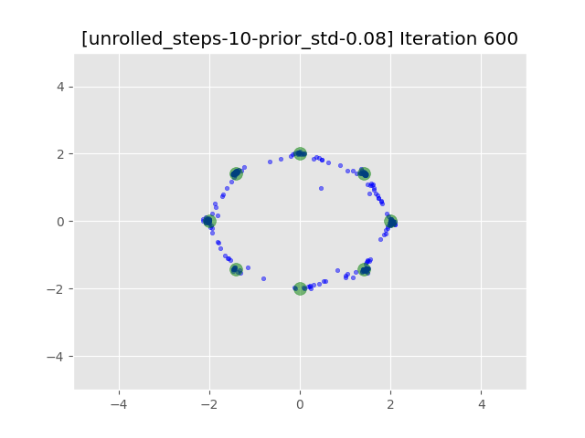

# Unrolled-GAN_pytorch
An simple and unoffcial implementation of [Unrolled GAN](https://arxiv.org/abs/1611.02163) based on Pytorch deep learning framework.

# Requirements
To run this code, you need to set the anaconda environment correctly. Please install the packages mentioned in requirements.txt firstly. Simply, for linux system, you should enter the path of this repo, and then, run
```
pip install requirements.txt
```
# Fast usage
This repo provide a simple implementation of Unrolled Generative Adversarial Networks based on mixture gaussian distribution. For your project, if you want to use unrolled-GAN, you can simply adjust your training strategy by these steps:
* Firstly, you need to store the state_dict of the discriminator;
* Then, train the discriminator N times without update to the generator;
* Next, train the generator one time with the supervision of the trained discriminator mentioned in the above step;
* Finally, what is important is that you need reload the state_dict of the discriminator you stored at first. 
The code about this can be found in g_loop() and d_loop() of main.py
# Qualitative Results
<figure>
    
    
    
    
    
    
    
    
    
    
</figure>